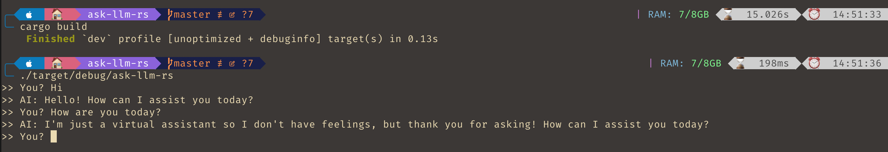

# ask-llm-rs
 




CLI build with Rust to interact with any LLM services.

## Usage

```bash
# create .env
cp .env.example .env
cargo run
```

Using Local LLM services

- [localAi](https://localai.io/)

```
LLM_BASE_URL=http://localhost:3928/v1/chat/completions
LLM_API_KEY=
LLM_MODEL=
```

Using Managed [LLM](https://en.wikipedia.org/wiki/Large_language_model) Services

- [OpenAI](https://platform.openai.com/)
```
LLM_BASE_URL=https://api.openai.com/v1/chat/completions
LLM_API_KEY=
LLM_MODEL=gpt-3.5-turbo
```

- [Claude](https://www.anthropic.com/api)

```
LLM_BASE_URL=https://api.anthropic.com/v1/messages
LLM_API_KEY=
LLM_MODEL=claude-3-5-sonnet-20240620
```

## License

MIT
